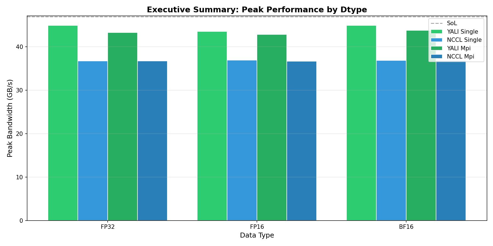
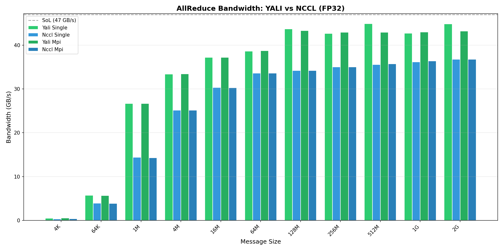
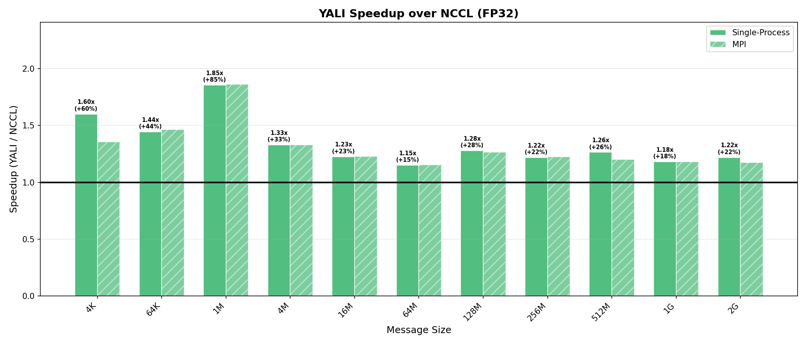
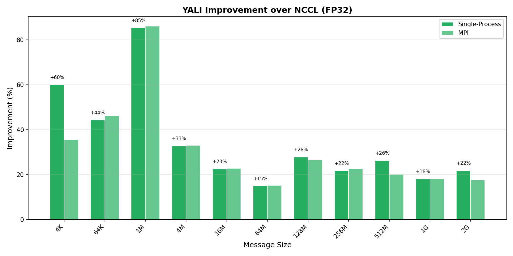
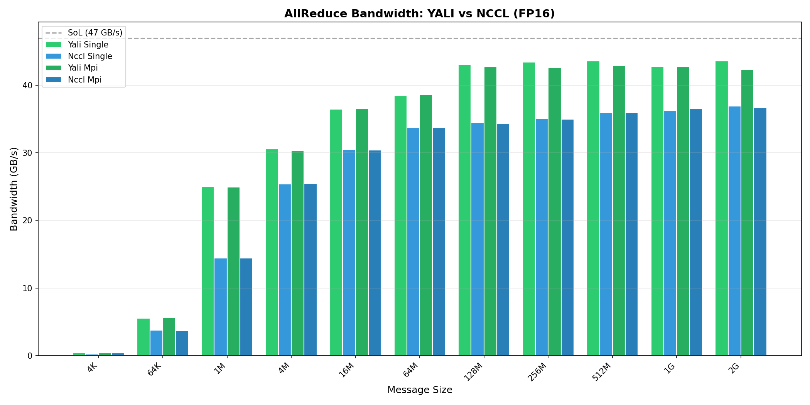
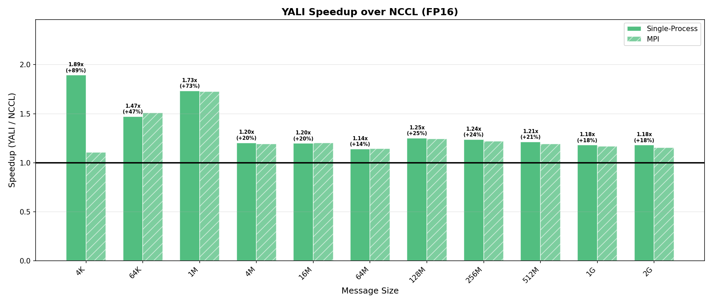
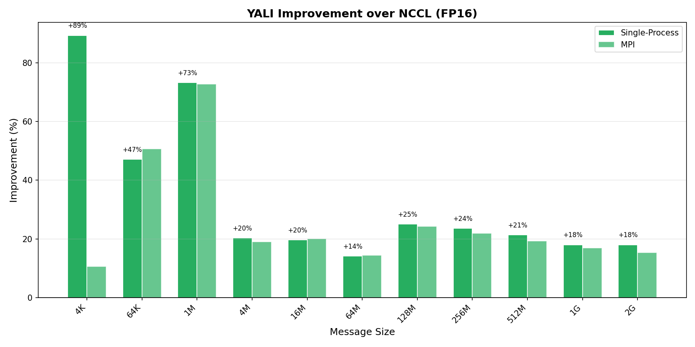
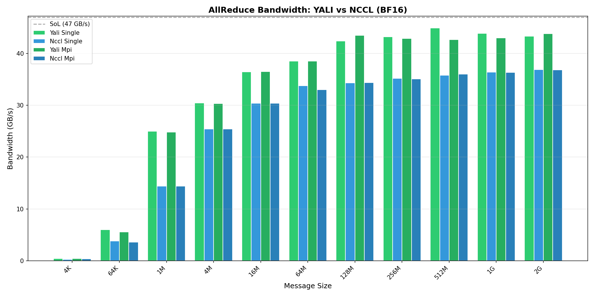
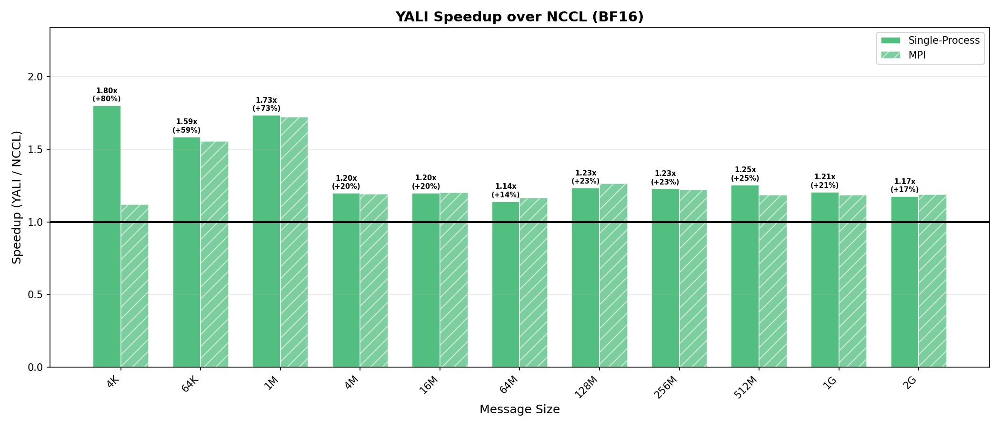
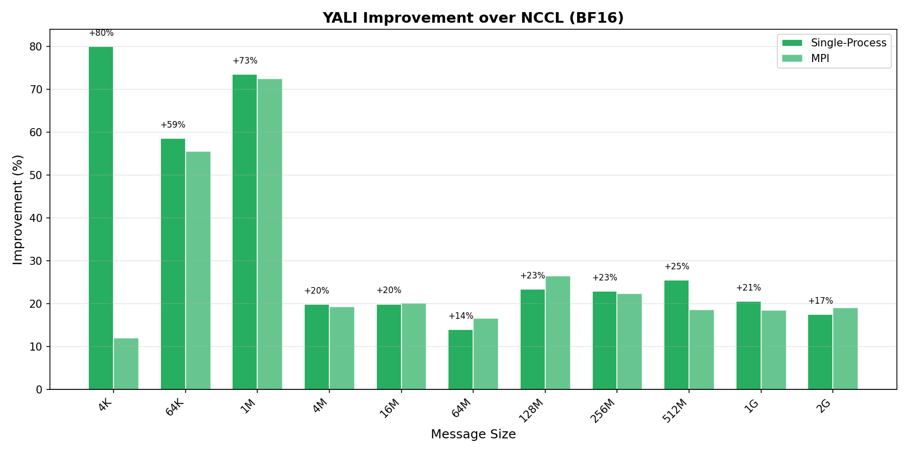

# YALI vs NCCL AllReduce Performance Comparison

**Date:** 2026-01-15 15:25:29
**Platform:** 2x NVIDIA A100-SXM4-80GB (NVLink)
**Mode:** Standard | Dtypes: FP32, FP16, BF16 | Sizes: 11 | Runs: 2

---

## Executive Summary



```
+-------+-------------+-------------+--------------+----------+----------+--------------+
| Dtype | Single YALI | Single NCCL |   Speedup    | Mpi YALI | Mpi NCCL |   Speedup    |
+-------+-------------+-------------+--------------+----------+----------+--------------+
| FP32  |    44.9     |    36.8     | 1.22x (+22%) |   43.3   |   36.8   | 1.18x (+18%) |
| FP16  |    43.6     |    36.9     | 1.18x (+18%) |   42.9   |   36.7   | 1.17x (+17%) |
| BF16  |    44.9     |    36.9     | 1.22x (+22%) |   43.8   |   36.8   | 1.19x (+19%) |
+-------+-------------+-------------+--------------+----------+----------+--------------+
```

---

## Hardware Baseline

```
+--------------------------+------------+
|          Metric          |   Value    |
+--------------------------+------------+
| nvbandwidth D2D (unidir) | 46.96 GB/s |
| nvbandwidth D2D (bidir)  | 91.56 GB/s |
|          NVLink          |    NV2     |
+--------------------------+------------+
```

---

## Example Correctness

```
+---------------+--------+
|    Example    | Status |
+---------------+--------+
|    simple     |  PASS  |
|   multilane   |  PASS  |
|  simple_mpi   |  PASS  |
| multilane_mpi |  PASS  |
+---------------+--------+
```

---

## FP32 Results

### Bandwidth Comparison


### Speedup Analysis


### Improvement Percentage


### Single - cuda-events

```
+--------+-------------+------+-------------+------+--------------+
|  Size  | YALI (GB/s) | SoL% | NCCL (GB/s) | SoL% |   Speedup    |
+--------+-------------+------+-------------+------+--------------+
|  4 KB  |    0.48     |  1%  |    0.30     |  1%  | 1.60x (+60%) |
| 64 KB  |   5.7±0.0   | 12%  |   4.0±0.1   |  8%  | 1.44x (+44%) |
|  1 MB  |  26.7±0.0   | 57%  |  14.4±0.0   | 31%  | 1.85x (+85%) |
|  4 MB  |  33.4±0.0   | 71%  |  25.1±0.0   | 54%  | 1.33x (+33%) |
| 16 MB  |  37.2±0.0   | 79%  |  30.4±0.1   | 65%  | 1.23x (+23%) |
| 64 MB  |  38.6±0.2   | 82%  |  33.6±0.0   | 72%  | 1.15x (+15%) |
| 128 MB |  43.7±0.2   | 93%  |  34.2±0.0   | 73%  | 1.28x (+28%) |
| 256 MB |  42.7±0.0   | 91%  |  35.0±0.0   | 75%  | 1.22x (+22%) |
| 512 MB |  44.9±1.6   | 96%  |  35.6±0.1   | 76%  | 1.26x (+26%) |
|  1 GB  |  42.7±0.5   | 91%  |  36.2±0.2   | 77%  | 1.18x (+18%) |
|  2 GB  |  44.8±0.8   | 95%  |  36.8±0.1   | 78%  | 1.22x (+22%) |
+--------+-------------+------+-------------+------+--------------+
```

### Mpi - cuda-events

```
+--------+-------------+------+-------------+------+--------------+
|  Size  | YALI (GB/s) | SoL% | NCCL (GB/s) | SoL% |   Speedup    |
+--------+-------------+------+-------------+------+--------------+
|  4 KB  |   0.5±0.1   |  1%  |   0.4±0.0   |  1%  | 1.36x (+36%) |
| 64 KB  |   5.7±0.0   | 12%  |   3.9±0.1   |  8%  | 1.46x (+46%) |
|  1 MB  |  26.6±0.0   | 57%  |  14.3±0.1   | 30%  | 1.86x (+86%) |
|  4 MB  |  33.4±0.1   | 71%  |  25.1±0.1   | 54%  | 1.33x (+33%) |
| 16 MB  |  37.2±0.0   | 79%  |  30.3±0.0   | 65%  | 1.23x (+23%) |
| 64 MB  |  38.8±0.1   | 83%  |  33.6±0.0   | 72%  | 1.15x (+15%) |
| 128 MB |  43.3±0.8   | 92%  |  34.2±0.1   | 73%  | 1.27x (+27%) |
| 256 MB |  42.9±0.6   | 91%  |  35.0±0.0   | 75%  | 1.23x (+23%) |
| 512 MB |  42.9±0.3   | 91%  |  35.7±0.1   | 76%  | 1.20x (+20%) |
|  1 GB  |  43.0±0.1   | 92%  |  36.4±0.1   | 78%  | 1.18x (+18%) |
|  2 GB  |  43.2±1.2   | 92%  |    36.76    | 78%  | 1.18x (+18%) |
+--------+-------------+------+-------------+------+--------------+
```

---

## FP16 Results

### Bandwidth Comparison


### Speedup Analysis


### Improvement Percentage


### Single - cuda-events

```
+--------+-------------+------+-------------+------+--------------+
|  Size  | YALI (GB/s) | SoL% | NCCL (GB/s) | SoL% |   Speedup    |
+--------+-------------+------+-------------+------+--------------+
|  4 KB  |    0.45     |  1%  |   0.2±0.1   |  1%  | 1.89x (+89%) |
| 64 KB  |   5.6±1.2   | 12%  |   3.8±0.0   |  8%  | 1.47x (+47%) |
|  1 MB  |  25.0±0.1   | 53%  |  14.4±0.1   | 31%  | 1.73x (+73%) |
|  4 MB  |  30.6±0.1   | 65%  |  25.4±0.0   | 54%  | 1.20x (+20%) |
| 16 MB  |  36.4±0.0   | 78%  |  30.4±0.1   | 65%  | 1.20x (+20%) |
| 64 MB  |  38.5±0.2   | 82%  |  33.7±0.1   | 72%  | 1.14x (+14%) |
| 128 MB |  43.1±1.1   | 92%  |  34.5±0.0   | 73%  | 1.25x (+25%) |
| 256 MB |  43.4±1.7   | 92%  |  35.1±0.2   | 75%  | 1.24x (+24%) |
| 512 MB |  43.6±1.8   | 93%  |  35.9±0.1   | 76%  | 1.21x (+21%) |
|  1 GB  |  42.8±0.2   | 91%  |  36.2±0.2   | 77%  | 1.18x (+18%) |
|  2 GB  |  43.6±0.6   | 93%  |  36.9±0.1   | 79%  | 1.18x (+18%) |
+--------+-------------+------+-------------+------+--------------+
```

### Mpi - cuda-events

```
+--------+-------------+------+-------------+------+--------------+
|  Size  | YALI (GB/s) | SoL% | NCCL (GB/s) | SoL% |   Speedup    |
+--------+-------------+------+-------------+------+--------------+
|  4 KB  |   0.4±0.0   |  1%  |   0.4±0.0   |  1%  | 1.11x (+11%) |
| 64 KB  |   5.6±0.1   | 12%  |    3.73     |  8%  | 1.51x (+51%) |
|  1 MB  |  24.9±0.0   | 53%  |  14.4±0.0   | 31%  | 1.73x (+73%) |
|  4 MB  |    30.30    | 65%  |  25.5±0.1   | 54%  | 1.19x (+19%) |
| 16 MB  |  36.5±0.2   | 78%  |  30.4±0.0   | 65%  | 1.20x (+20%) |
| 64 MB  |  38.6±0.1   | 82%  |  33.7±0.0   | 72%  | 1.14x (+14%) |
| 128 MB |  42.7±0.2   | 91%  |  34.3±0.0   | 73%  | 1.24x (+24%) |
| 256 MB |  42.6±0.3   | 91%  |  35.0±0.1   | 74%  | 1.22x (+22%) |
| 512 MB |  42.9±0.0   | 91%  |  35.9±0.2   | 77%  | 1.19x (+19%) |
|  1 GB  |  42.7±0.7   | 91%  |  36.5±0.1   | 78%  | 1.17x (+17%) |
|  2 GB  |  42.3±0.1   | 90%  |  36.7±0.1   | 78%  | 1.15x (+15%) |
+--------+-------------+------+-------------+------+--------------+
```

---

## BF16 Results

### Bandwidth Comparison


### Speedup Analysis


### Improvement Percentage


### Single - cuda-events

```
+--------+-------------+------+-------------+------+--------------+
|  Size  | YALI (GB/s) | SoL% | NCCL (GB/s) | SoL% |   Speedup    |
+--------+-------------+------+-------------+------+--------------+
|  4 KB  |    0.45     |  1%  |   0.2±0.0   |  1%  | 1.80x (+80%) |
| 64 KB  |   6.0±0.7   | 13%  |    3.79     |  8%  | 1.59x (+59%) |
|  1 MB  |  25.0±0.0   | 53%  |  14.4±0.0   | 31%  | 1.73x (+73%) |
|  4 MB  |  30.4±0.3   | 65%  |  25.4±0.0   | 54%  | 1.20x (+20%) |
| 16 MB  |  36.5±0.0   | 78%  |  30.4±0.0   | 65%  | 1.20x (+20%) |
| 64 MB  |  38.5±0.2   | 82%  |  33.8±0.0   | 72%  | 1.14x (+14%) |
| 128 MB |  42.4±0.7   | 90%  |  34.3±0.1   | 73%  | 1.23x (+23%) |
| 256 MB |  43.2±2.0   | 92%  |  35.2±0.1   | 75%  | 1.23x (+23%) |
| 512 MB |  44.9±0.8   | 96%  |    35.80    | 76%  | 1.25x (+25%) |
|  1 GB  |  43.9±1.8   | 93%  |  36.4±0.1   | 78%  | 1.21x (+21%) |
|  2 GB  |  43.3±0.2   | 92%  |  36.9±0.0   | 78%  | 1.17x (+17%) |
+--------+-------------+------+-------------+------+--------------+
```

### Mpi - cuda-events

```
+--------+-------------+------+-------------+------+--------------+
|  Size  | YALI (GB/s) | SoL% | NCCL (GB/s) | SoL% |   Speedup    |
+--------+-------------+------+-------------+------+--------------+
|  4 KB  |   0.4±0.1   |  1%  |   0.4±0.0   |  1%  | 1.12x (+12%) |
| 64 KB  |   5.6±0.0   | 12%  |   3.6±0.0   |  8%  | 1.55x (+55%) |
|  1 MB  |  24.8±0.1   | 53%  |  14.4±0.0   | 31%  | 1.72x (+72%) |
|  4 MB  |  30.3±0.0   | 65%  |  25.4±0.0   | 54%  | 1.19x (+19%) |
| 16 MB  |  36.5±0.0   | 78%  |  30.4±0.0   | 65%  | 1.20x (+20%) |
| 64 MB  |  38.5±0.2   | 82%  |  33.0±0.3   | 70%  | 1.17x (+17%) |
| 128 MB |  43.5±0.9   | 93%  |    34.39    | 73%  | 1.26x (+26%) |
| 256 MB |  42.9±1.4   | 91%  |  35.1±0.1   | 75%  | 1.22x (+22%) |
| 512 MB |  42.7±0.9   | 91%  |  36.0±0.2   | 77%  | 1.19x (+19%) |
|  1 GB  |  43.0±1.7   | 92%  |  36.3±0.1   | 77%  | 1.18x (+18%) |
|  2 GB  |  43.8±2.2   | 93%  |  36.8±0.1   | 78%  | 1.19x (+19%) |
+--------+-------------+------+-------------+------+--------------+
```

---

## Reproducibility

```bash
python scripts/sweep.py
```
