# YALI vs NCCL AllReduce Performance Comparison

**Date:** 2026-01-15 15:48:08
**Platform:** 2x NVIDIA A100-SXM4-80GB (NVLink)
**Mode:** Extensive | Dtypes: FP32, FP16, BF16 | Sizes: 2 | Runs: 10

---

## Executive Summary

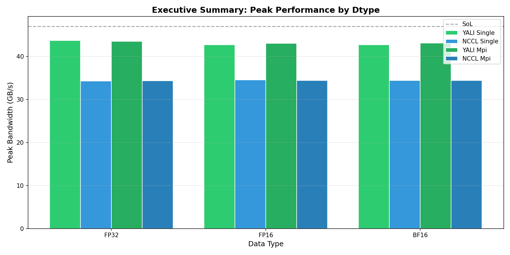

```
+-------+-------------+-------------+--------------+----------+----------+--------------+
| Dtype | Single YALI | Single NCCL |   Speedup    | Mpi YALI | Mpi NCCL |   Speedup    |
+-------+-------------+-------------+--------------+----------+----------+--------------+
| FP32  |    43.7     |    34.3     | 1.27x (+27%) |   43.5   |   34.3   | 1.27x (+27%) |
| FP16  |    42.7     |    34.5     | 1.24x (+24%) |   43.0   |   34.4   | 1.25x (+25%) |
| BF16  |    42.7     |    34.4     | 1.24x (+24%) |   43.1   |   34.4   | 1.25x (+25%) |
+-------+-------------+-------------+--------------+----------+----------+--------------+
```

---

## Hardware Baseline

```
+--------------------------+------------+
|          Metric          |   Value    |
+--------------------------+------------+
| nvbandwidth D2D (unidir) | 46.96 GB/s |
| nvbandwidth D2D (bidir)  | 91.56 GB/s |
|          NVLink          |    NV2     |
+--------------------------+------------+
```

---

## Example Correctness

```
+---------------+--------+
|    Example    | Status |
+---------------+--------+
|    simple     |  PASS  |
|   multilane   |  PASS  |
|  simple_mpi   |  PASS  |
| multilane_mpi |  PASS  |
+---------------+--------+
```

---

## FP32 Results

### Bandwidth Comparison
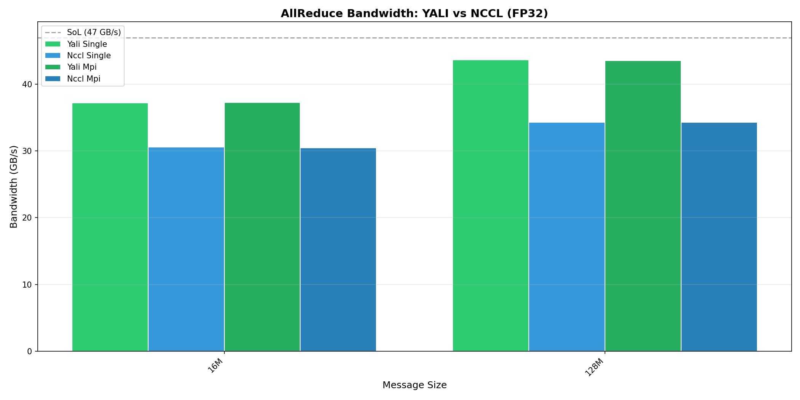

### Speedup Analysis
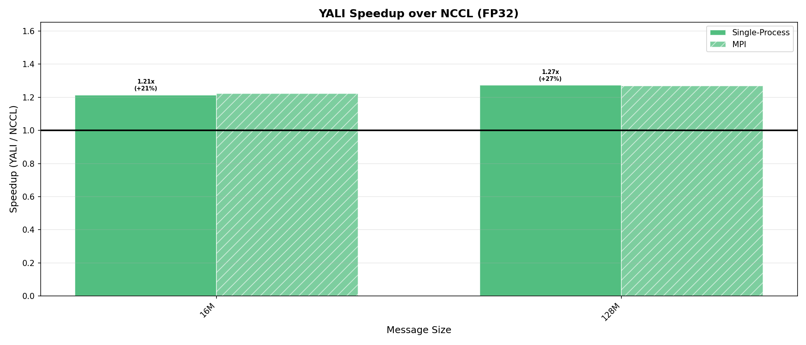

### Improvement Percentage
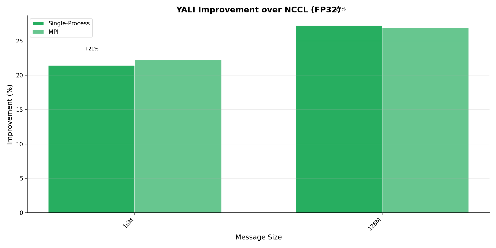

### Timing Mode Comparison
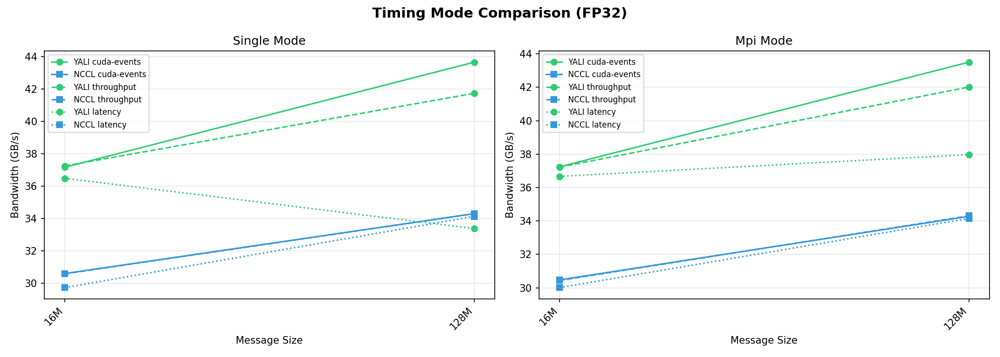

### Single - cuda-events

```
+--------+-------------+------+-------------+------+--------------+
|  Size  | YALI (GB/s) | SoL% | NCCL (GB/s) | SoL% |   Speedup    |
+--------+-------------+------+-------------+------+--------------+
| 16 MB  |  37.2±0.0   | 79%  |  30.6±0.5   | 65%  | 1.21x (+21%) |
| 128 MB |  43.7±1.0   | 93%  |  34.3±0.1   | 73%  | 1.27x (+27%) |
+--------+-------------+------+-------------+------+--------------+
```

### Single - throughput

```
+--------+-------------+------+-------------+------+--------------+
|  Size  | YALI (GB/s) | SoL% | NCCL (GB/s) | SoL% |   Speedup    |
+--------+-------------+------+-------------+------+--------------+
| 16 MB  |  37.2±0.2   | 79%  |  30.6±0.5   | 65%  | 1.22x (+22%) |
| 128 MB |  41.7±0.1   | 89%  |  34.3±0.1   | 73%  | 1.22x (+22%) |
+--------+-------------+------+-------------+------+--------------+
```

### Single - latency

```
+--------+-------------+------+-------------+------+--------------+
|  Size  | YALI (GB/s) | SoL% | NCCL (GB/s) | SoL% |   Speedup    |
+--------+-------------+------+-------------+------+--------------+
| 16 MB  |  36.5±0.2   | 78%  |  29.7±0.4   | 63%  | 1.23x (+23%) |
| 128 MB |  33.4±0.1   | 71%  |  34.1±0.1   | 73%  | 0.98x (-2%)  |
+--------+-------------+------+-------------+------+--------------+
```

### Mpi - cuda-events

```
+--------+-------------+------+-------------+------+--------------+
|  Size  | YALI (GB/s) | SoL% | NCCL (GB/s) | SoL% |   Speedup    |
+--------+-------------+------+-------------+------+--------------+
| 16 MB  |  37.2±0.2   | 79%  |  30.5±0.5   | 65%  | 1.22x (+22%) |
| 128 MB |  43.5±1.1   | 93%  |  34.3±0.1   | 73%  | 1.27x (+27%) |
+--------+-------------+------+-------------+------+--------------+
```

### Mpi - throughput

```
+--------+-------------+------+-------------+------+--------------+
|  Size  | YALI (GB/s) | SoL% | NCCL (GB/s) | SoL% |   Speedup    |
+--------+-------------+------+-------------+------+--------------+
| 16 MB  |  37.2±0.2   | 79%  |  30.4±0.5   | 65%  | 1.22x (+22%) |
| 128 MB |  42.0±0.1   | 89%  |  34.3±0.1   | 73%  | 1.22x (+22%) |
+--------+-------------+------+-------------+------+--------------+
```

### Mpi - latency

```
+--------+-------------+------+-------------+------+--------------+
|  Size  | YALI (GB/s) | SoL% | NCCL (GB/s) | SoL% |   Speedup    |
+--------+-------------+------+-------------+------+--------------+
| 16 MB  |  36.7±0.2   | 78%  |  30.0±0.5   | 64%  | 1.22x (+22%) |
| 128 MB |  38.0±0.1   | 81%  |  34.1±0.1   | 73%  | 1.11x (+11%) |
+--------+-------------+------+-------------+------+--------------+
```

---

## FP16 Results

### Bandwidth Comparison
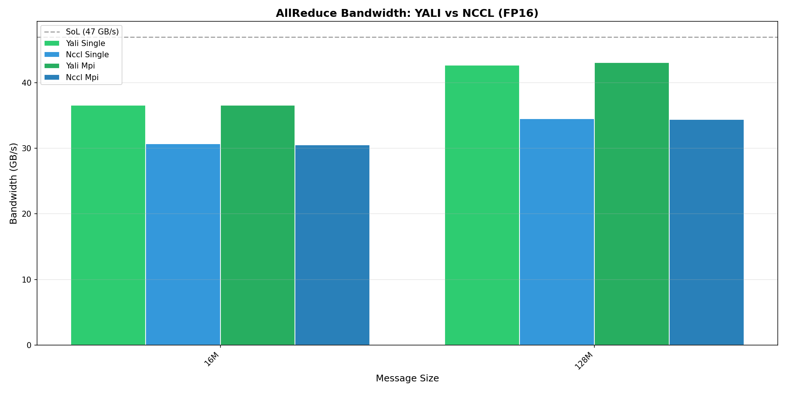

### Speedup Analysis
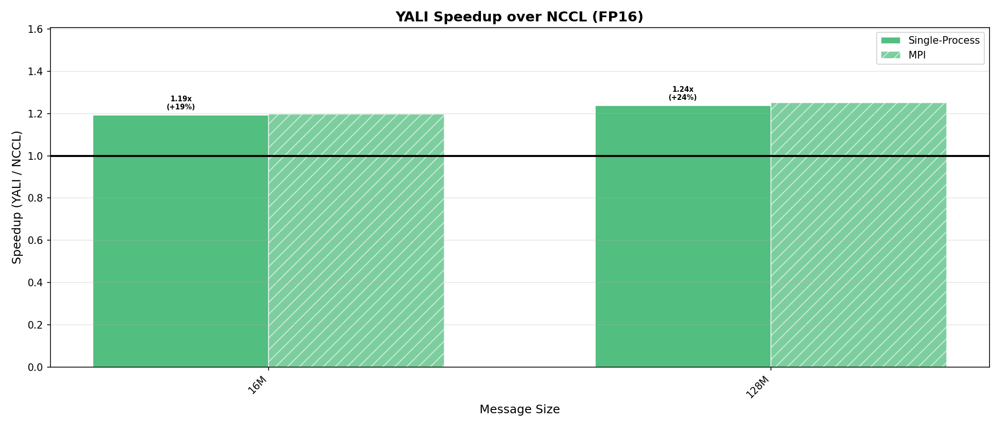

### Improvement Percentage
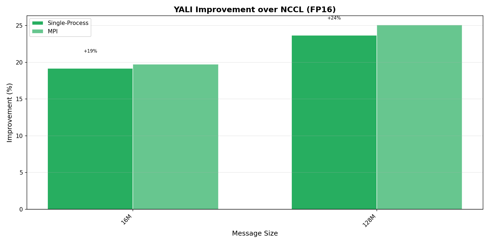

### Timing Mode Comparison
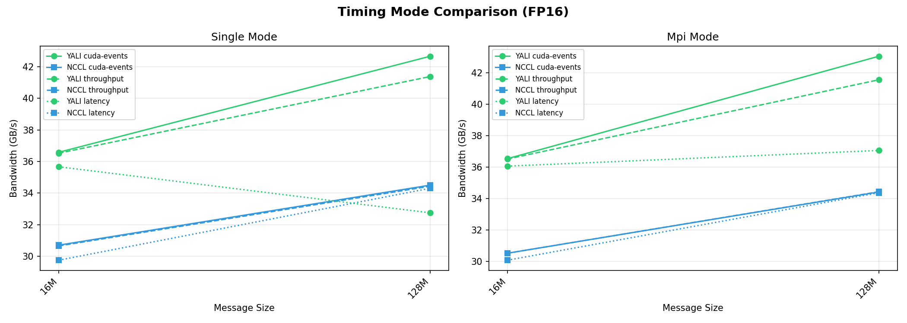

### Single - cuda-events

```
+--------+-------------+------+-------------+------+--------------+
|  Size  | YALI (GB/s) | SoL% | NCCL (GB/s) | SoL% |   Speedup    |
+--------+-------------+------+-------------+------+--------------+
| 16 MB  |  36.6±0.3   | 78%  |  30.7±0.4   | 65%  | 1.19x (+19%) |
| 128 MB |  42.7±1.1   | 91%  |  34.5±0.1   | 73%  | 1.24x (+24%) |
+--------+-------------+------+-------------+------+--------------+
```

### Single - throughput

```
+--------+-------------+------+-------------+------+--------------+
|  Size  | YALI (GB/s) | SoL% | NCCL (GB/s) | SoL% |   Speedup    |
+--------+-------------+------+-------------+------+--------------+
| 16 MB  |  36.5±0.2   | 78%  |  30.6±0.4   | 65%  | 1.19x (+19%) |
| 128 MB |  41.4±0.2   | 88%  |  34.4±0.1   | 73%  | 1.20x (+20%) |
+--------+-------------+------+-------------+------+--------------+
```

### Single - latency

```
+--------+-------------+------+-------------+------+--------------+
|  Size  | YALI (GB/s) | SoL% | NCCL (GB/s) | SoL% |   Speedup    |
+--------+-------------+------+-------------+------+--------------+
| 16 MB  |  35.7±0.2   | 76%  |  29.7±0.5   | 63%  | 1.20x (+20%) |
| 128 MB |  32.7±0.1   | 70%  |  34.3±0.1   | 73%  | 0.95x (-5%)  |
+--------+-------------+------+-------------+------+--------------+
```

### Mpi - cuda-events

```
+--------+-------------+------+-------------+------+--------------+
|  Size  | YALI (GB/s) | SoL% | NCCL (GB/s) | SoL% |   Speedup    |
+--------+-------------+------+-------------+------+--------------+
| 16 MB  |  36.5±0.2   | 78%  |  30.5±0.5   | 65%  | 1.20x (+20%) |
| 128 MB |  43.0±1.1   | 92%  |  34.4±0.1   | 73%  | 1.25x (+25%) |
+--------+-------------+------+-------------+------+--------------+
```

### Mpi - throughput

```
+--------+-------------+------+-------------+------+--------------+
|  Size  | YALI (GB/s) | SoL% | NCCL (GB/s) | SoL% |   Speedup    |
+--------+-------------+------+-------------+------+--------------+
| 16 MB  |  36.5±0.2   | 78%  |  30.5±0.5   | 65%  | 1.20x (+20%) |
| 128 MB |  41.6±0.1   | 88%  |  34.4±0.1   | 73%  | 1.21x (+21%) |
+--------+-------------+------+-------------+------+--------------+
```

### Mpi - latency

```
+--------+-------------+------+-------------+------+--------------+
|  Size  | YALI (GB/s) | SoL% | NCCL (GB/s) | SoL% |   Speedup    |
+--------+-------------+------+-------------+------+--------------+
| 16 MB  |  36.1±0.2   | 77%  |  30.1±0.5   | 64%  | 1.20x (+20%) |
| 128 MB |  37.1±0.1   | 79%  |  34.4±0.1   | 73%  | 1.08x (+8%)  |
+--------+-------------+------+-------------+------+--------------+
```

---

## BF16 Results

### Bandwidth Comparison


### Speedup Analysis
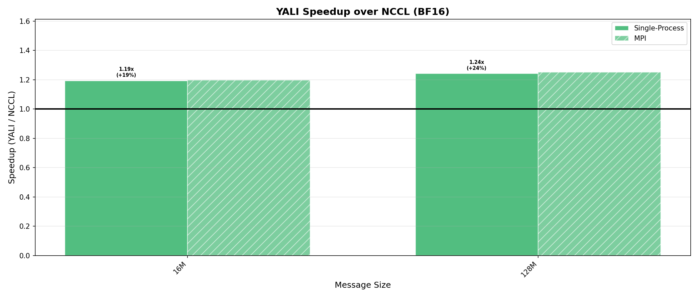

### Improvement Percentage
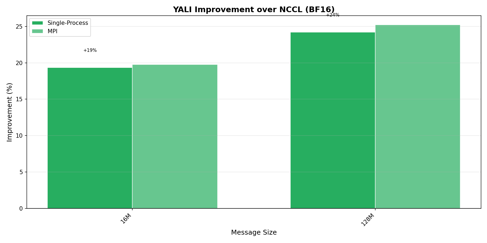

### Timing Mode Comparison
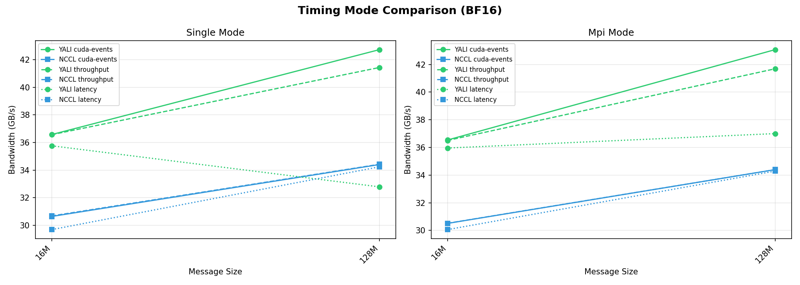

### Single - cuda-events

```
+--------+-------------+------+-------------+------+--------------+
|  Size  | YALI (GB/s) | SoL% | NCCL (GB/s) | SoL% |   Speedup    |
+--------+-------------+------+-------------+------+--------------+
| 16 MB  |  36.6±0.3   | 78%  |  30.6±0.5   | 65%  | 1.19x (+19%) |
| 128 MB |  42.7±0.7   | 91%  |  34.4±0.1   | 73%  | 1.24x (+24%) |
+--------+-------------+------+-------------+------+--------------+
```

### Single - throughput

```
+--------+-------------+------+-------------+------+--------------+
|  Size  | YALI (GB/s) | SoL% | NCCL (GB/s) | SoL% |   Speedup    |
+--------+-------------+------+-------------+------+--------------+
| 16 MB  |  36.6±0.2   | 78%  |  30.7±0.4   | 65%  | 1.19x (+19%) |
| 128 MB |  41.4±0.1   | 88%  |  34.4±0.1   | 73%  | 1.20x (+20%) |
+--------+-------------+------+-------------+------+--------------+
```

### Single - latency

```
+--------+-------------+------+-------------+------+--------------+
|  Size  | YALI (GB/s) | SoL% | NCCL (GB/s) | SoL% |   Speedup    |
+--------+-------------+------+-------------+------+--------------+
| 16 MB  |  35.8±0.3   | 76%  |  29.7±0.5   | 63%  | 1.20x (+20%) |
| 128 MB |  32.8±0.0   | 70%  |  34.2±0.1   | 73%  | 0.96x (-4%)  |
+--------+-------------+------+-------------+------+--------------+
```

### Mpi - cuda-events

```
+--------+-------------+------+-------------+------+--------------+
|  Size  | YALI (GB/s) | SoL% | NCCL (GB/s) | SoL% |   Speedup    |
+--------+-------------+------+-------------+------+--------------+
| 16 MB  |  36.5±0.2   | 78%  |  30.5±0.5   | 65%  | 1.20x (+20%) |
| 128 MB |  43.1±0.5   | 92%  |  34.4±0.1   | 73%  | 1.25x (+25%) |
+--------+-------------+------+-------------+------+--------------+
```

### Mpi - throughput

```
+--------+-------------+------+-------------+------+--------------+
|  Size  | YALI (GB/s) | SoL% | NCCL (GB/s) | SoL% |   Speedup    |
+--------+-------------+------+-------------+------+--------------+
| 16 MB  |  36.5±0.2   | 78%  |  30.5±0.5   | 65%  | 1.20x (+20%) |
| 128 MB |  41.7±0.1   | 89%  |  34.4±0.1   | 73%  | 1.21x (+21%) |
+--------+-------------+------+-------------+------+--------------+
```

### Mpi - latency

```
+--------+-------------+------+-------------+------+--------------+
|  Size  | YALI (GB/s) | SoL% | NCCL (GB/s) | SoL% |   Speedup    |
+--------+-------------+------+-------------+------+--------------+
| 16 MB  |  36.0±0.2   | 77%  |  30.1±0.5   | 64%  | 1.20x (+20%) |
| 128 MB |  37.0±0.0   | 79%  |  34.3±0.1   | 73%  | 1.08x (+8%)  |
+--------+-------------+------+-------------+------+--------------+
```

---

## Stability Analysis (Extensive Mode)

### FP32 Stability

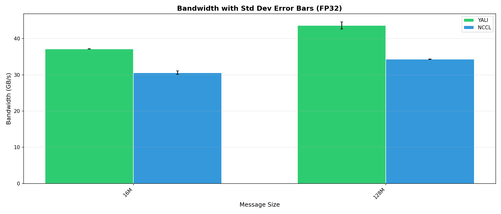

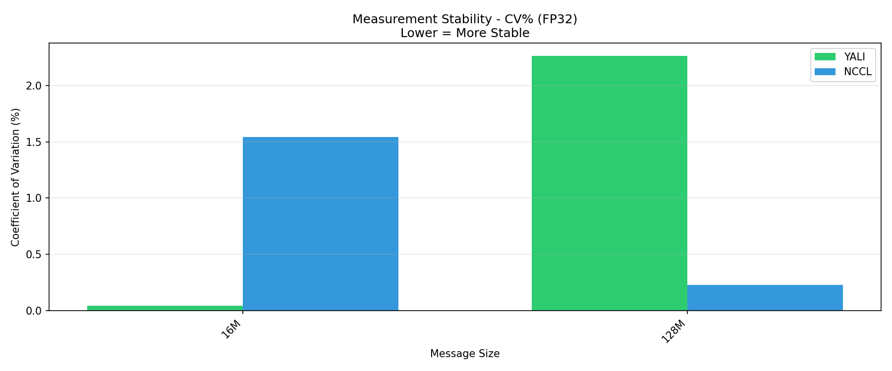

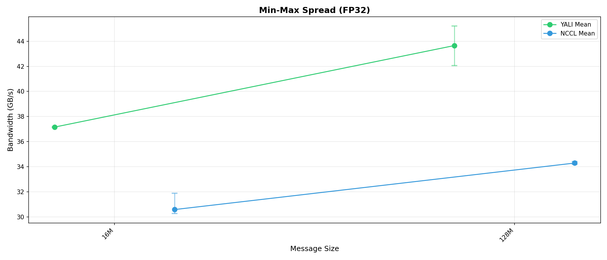

### FP16 Stability


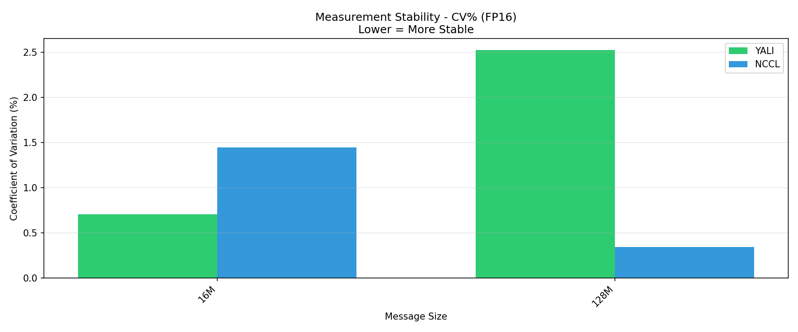

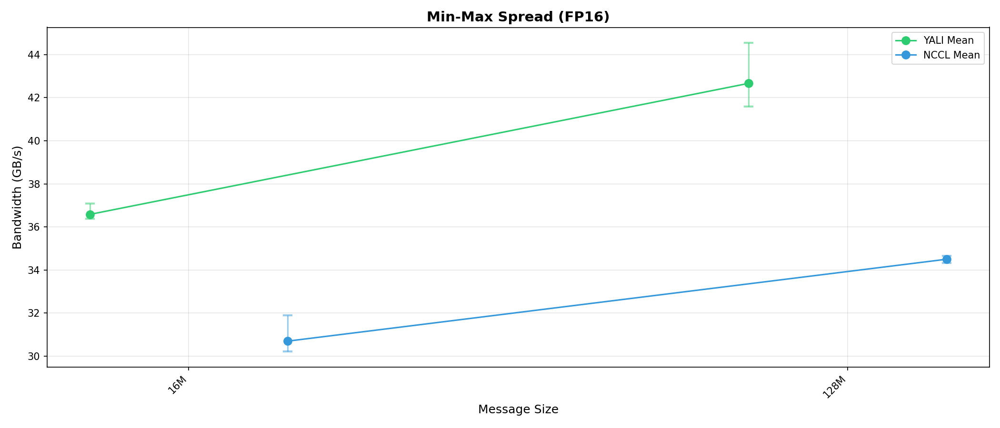

### BF16 Stability

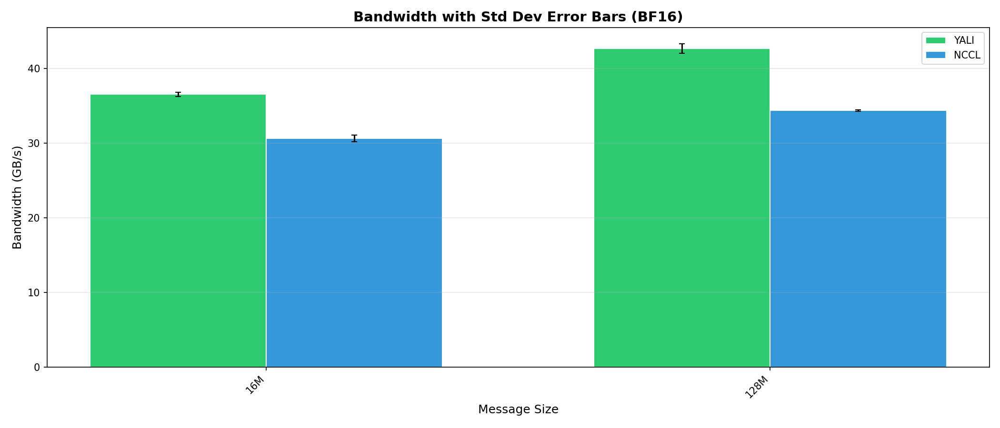

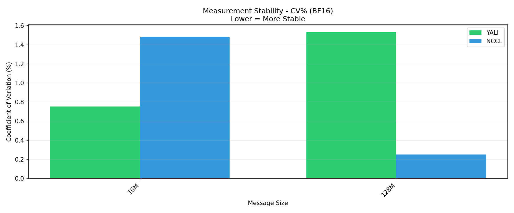

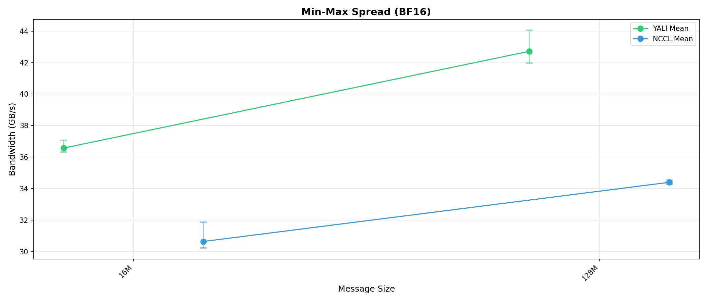

---

## Latency Analysis (Extensive Mode)

### FP32 Latency Distribution

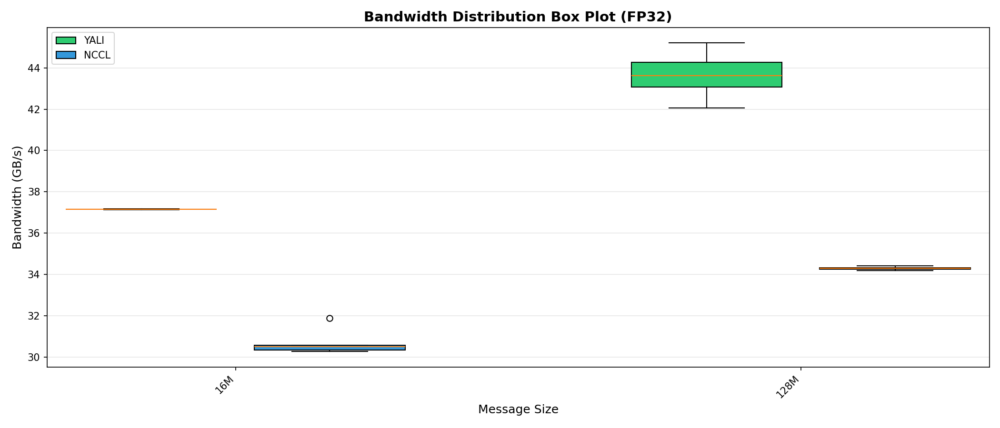

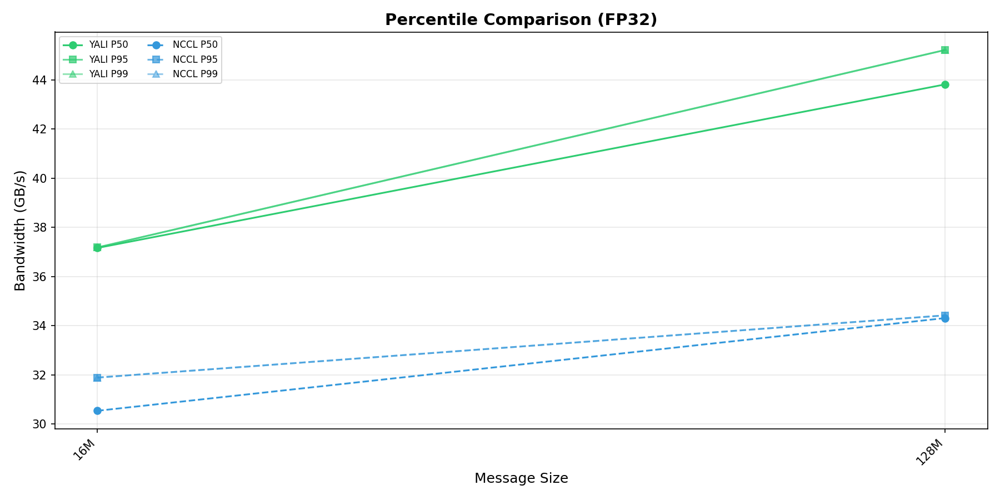

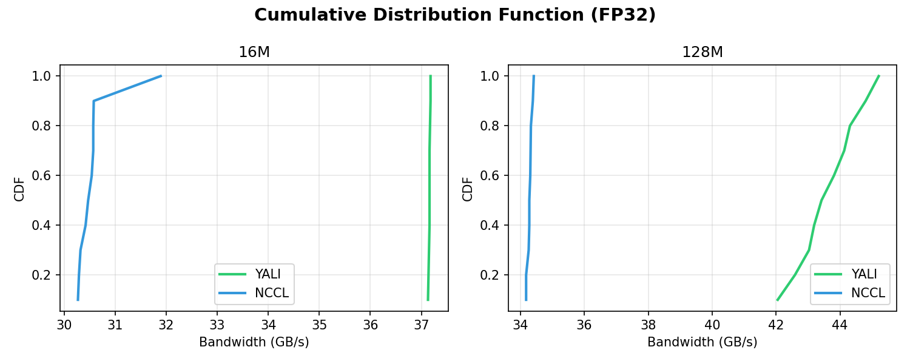

#### FP32 Percentiles Table

```
+------+----------+----------+----------+----------+----------+----------+
| Size | YALI P50 | YALI P95 | YALI P99 | NCCL P50 | NCCL P95 | NCCL P99 |
+------+----------+----------+----------+----------+----------+----------+
| 16M  |   37.2   |   37.2   |   37.2   |   30.5   |   31.9   |   31.9   |
| 128M |   43.8   |   45.2   |   45.2   |   34.3   |   34.4   |   34.4   |
+------+----------+----------+----------+----------+----------+----------+
```

### FP16 Latency Distribution

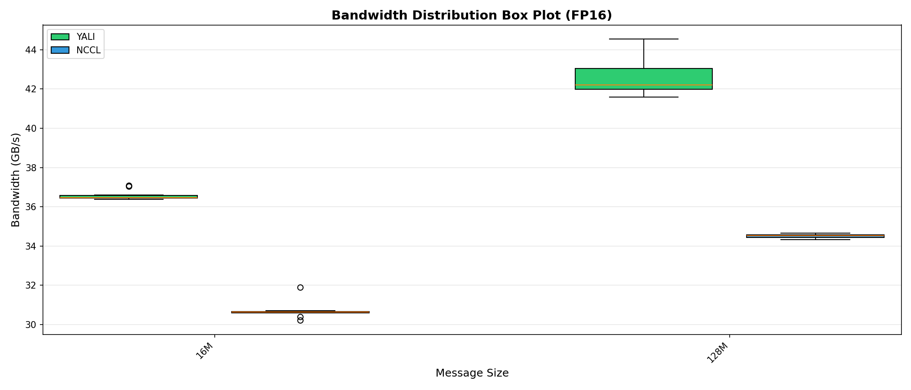

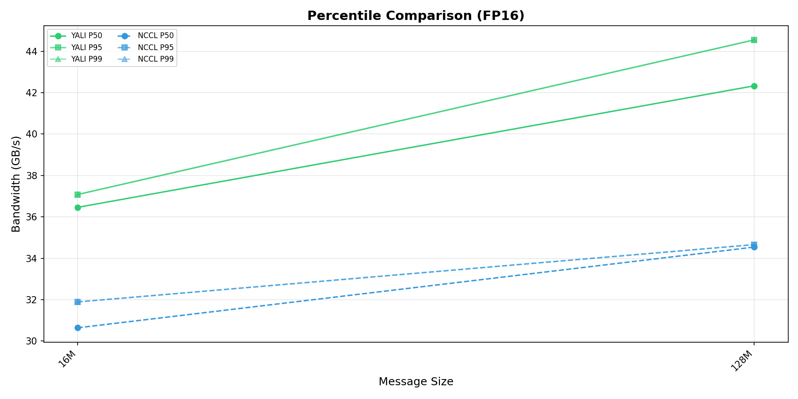

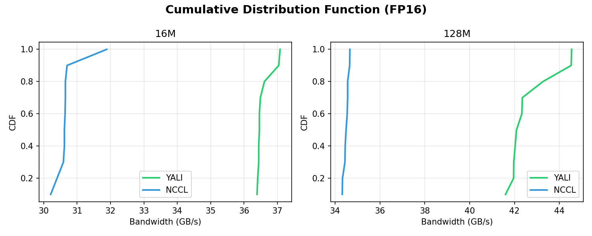

#### FP16 Percentiles Table

```
+------+----------+----------+----------+----------+----------+----------+
| Size | YALI P50 | YALI P95 | YALI P99 | NCCL P50 | NCCL P95 | NCCL P99 |
+------+----------+----------+----------+----------+----------+----------+
| 16M  |   36.5   |   37.1   |   37.1   |   30.6   |   31.9   |   31.9   |
| 128M |   42.3   |   44.5   |   44.5   |   34.5   |   34.7   |   34.7   |
+------+----------+----------+----------+----------+----------+----------+
```

### BF16 Latency Distribution

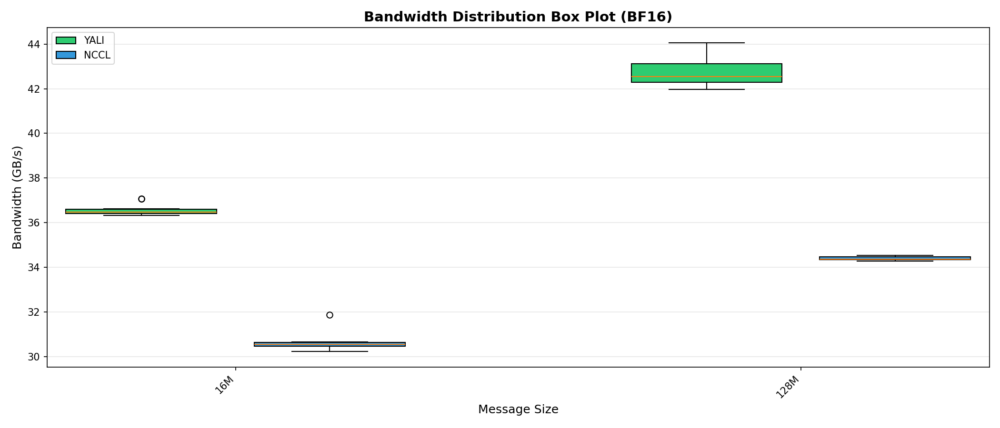

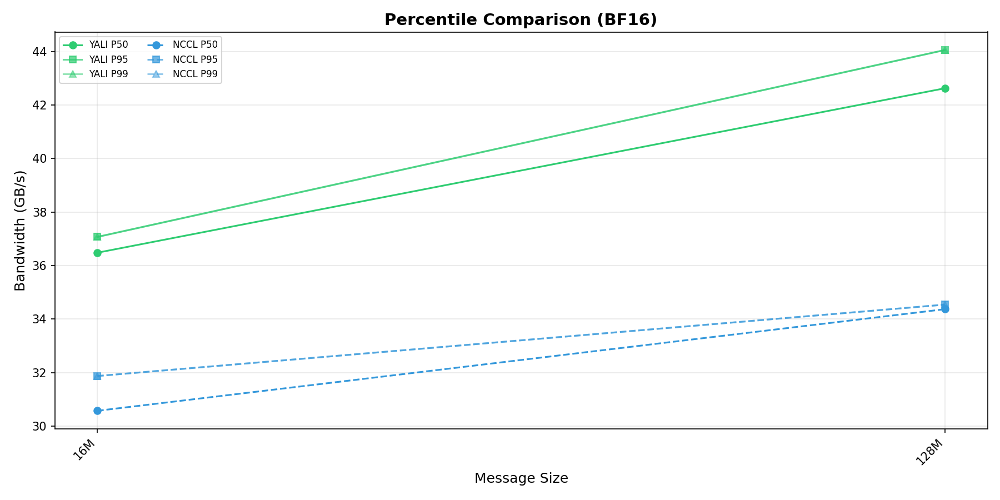

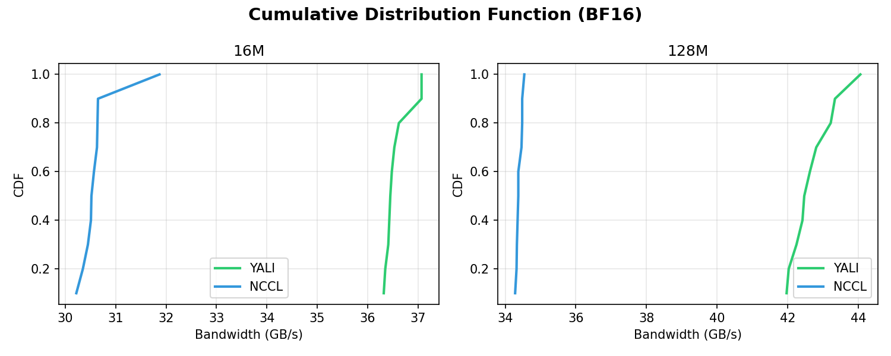

#### BF16 Percentiles Table

```
+------+----------+----------+----------+----------+----------+----------+
| Size | YALI P50 | YALI P95 | YALI P99 | NCCL P50 | NCCL P95 | NCCL P99 |
+------+----------+----------+----------+----------+----------+----------+
| 16M  |   36.5   |   37.1   |   37.1   |   30.6   |   31.9   |   31.9   |
| 128M |   42.6   |   44.1   |   44.1   |   34.4   |   34.5   |   34.5   |
+------+----------+----------+----------+----------+----------+----------+
```

---

## Speedup Heatmap

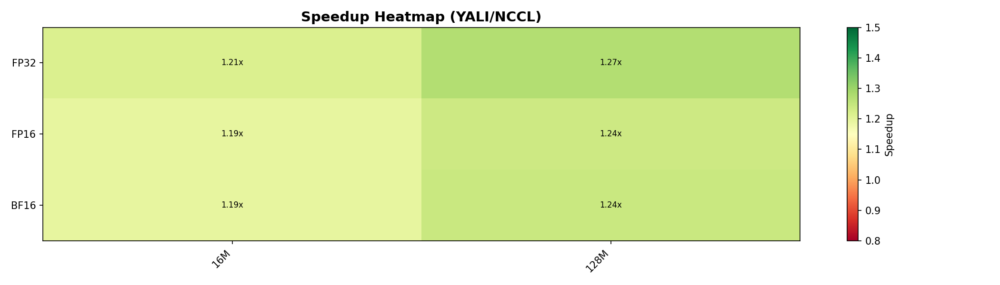

---

## Reproducibility

```bash
python scripts/sweep.py --extensive
```
