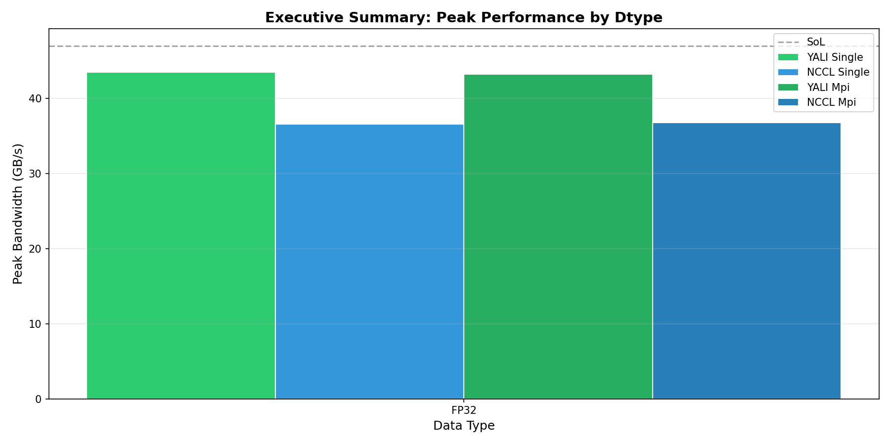
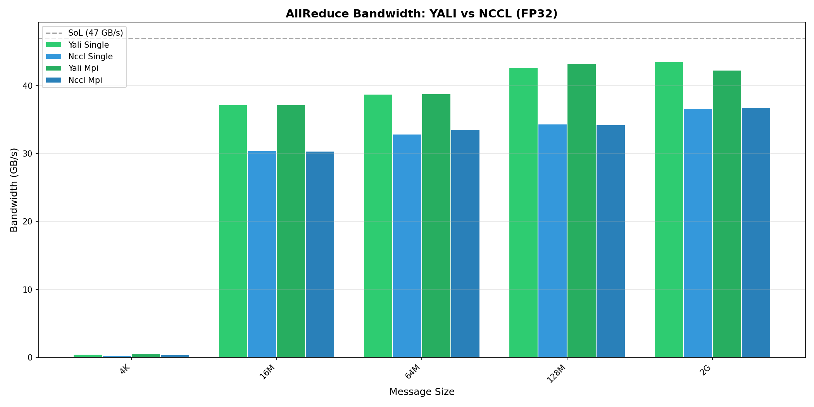
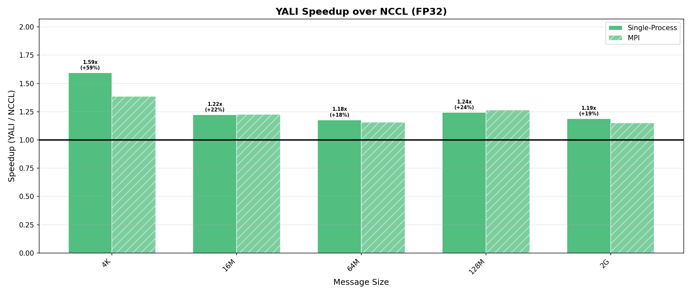
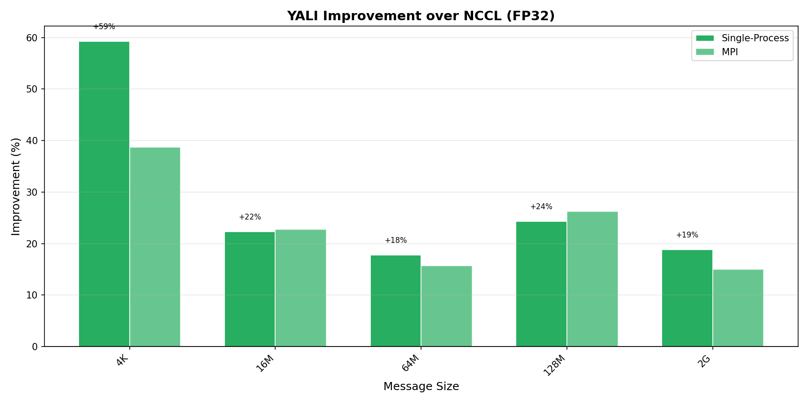
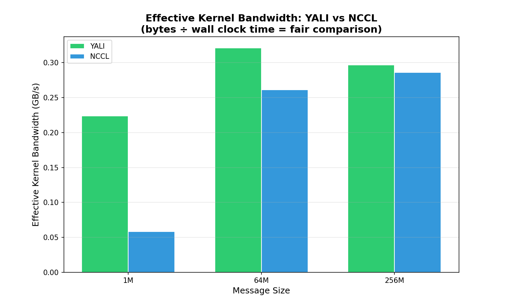
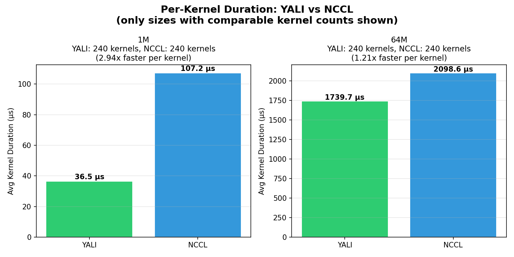

# YALI vs NCCL AllReduce Performance Comparison

**Date:** 2026-01-15 16:49:07
**Platform:** 2x NVIDIA A100-SXM4-80GB (NVLink)
**Mode:** Quick | Dtypes: FP32 | Sizes: 5 | Runs: 2

---

## Executive Summary



```
+-------+-------------+-------------+--------------+----------+----------+--------------+
| Dtype | Single YALI | Single NCCL |   Speedup    | Mpi YALI | Mpi NCCL |   Speedup    |
+-------+-------------+-------------+--------------+----------+----------+--------------+
| FP32  |    43.5     |    36.6     | 1.19x (+19%) |   43.2   |   36.8   | 1.18x (+18%) |
+-------+-------------+-------------+--------------+----------+----------+--------------+
```

---

## Hardware Baseline

```
+--------------------------+------------+
|          Metric          |   Value    |
+--------------------------+------------+
| nvbandwidth D2D (unidir) | 46.96 GB/s |
| nvbandwidth D2D (bidir)  | 91.56 GB/s |
|          NVLink          |    NV2     |
+--------------------------+------------+
```

---

## Example Correctness

```
+---------------+--------+
|    Example    | Status |
+---------------+--------+
|    simple     |  PASS  |
|   multilane   |  PASS  |
|  simple_mpi   |  PASS  |
| multilane_mpi |  PASS  |
+---------------+--------+
```

---

## FP32 Results

### Bandwidth Comparison


### Speedup Analysis


### Improvement Percentage


### Single - cuda-events

```
+--------+-------------+------+-------------+------+--------------+
|  Size  | YALI (GB/s) | SoL% | NCCL (GB/s) | SoL% |   Speedup    |
+--------+-------------+------+-------------+------+--------------+
|  4 KB  |   0.5±0.0   |  1%  |    0.29     |  1%  | 1.59x (+59%) |
| 16 MB  |  37.2±0.0   | 79%  |  30.4±0.1   | 65%  | 1.22x (+22%) |
| 64 MB  |  38.7±0.1   | 82%  |  32.9±1.1   | 70%  | 1.18x (+18%) |
| 128 MB |  42.6±0.9   | 91%  |  34.3±0.0   | 73%  | 1.24x (+24%) |
|  2 GB  |  43.5±1.8   | 93%  |  36.6±0.2   | 78%  | 1.19x (+19%) |
+--------+-------------+------+-------------+------+--------------+
```

### Mpi - cuda-events

```
+--------+-------------+------+-------------+------+--------------+
|  Size  | YALI (GB/s) | SoL% | NCCL (GB/s) | SoL% |   Speedup    |
+--------+-------------+------+-------------+------+--------------+
|  4 KB  |   0.5±0.1   |  1%  |   0.4±0.0   |  1%  | 1.39x (+39%) |
| 16 MB  |  37.2±0.0   | 79%  |  30.3±0.0   | 65%  | 1.23x (+23%) |
| 64 MB  |    38.80    | 83%  |  33.6±0.0   | 71%  | 1.16x (+16%) |
| 128 MB |  43.2±0.4   | 92%  |    34.25    | 73%  | 1.26x (+26%) |
|  2 GB  |  42.3±0.3   | 90%  |  36.8±0.1   | 78%  | 1.15x (+15%) |
+--------+-------------+------+-------------+------+--------------+
```

---

## Profiler Results (nsys)

Kernel-level timing captured via NVIDIA Nsight Systems.

### Effective Kernel Bandwidth

Fair comparison metric: `bytes ÷ wall_clock_time = GB/s`

*Wall clock = first kernel start to last kernel end (accounts for overlapping kernels)*



### Per-Kernel Duration

*Only shown for message sizes with comparable kernel counts (≤2x ratio)*



### Profiler Summary

```
+------+-------------------+-------------------+---------------+
| Size | YALI BW (kernels) | NCCL BW (kernels) |    Speedup    |
+------+-------------------+-------------------+---------------+
|  1M  |  0.2 GB/s (240)   |  0.1 GB/s (240)   | 3.82x (+282%) |
| 64M  |  0.3 GB/s (240)   |  0.3 GB/s (240)   | 1.23x (+23%)  |
| 256M | 0.3 GB/s (30720)  |  0.3 GB/s (240)   |  1.04x (+4%)  |
+------+-------------------+-------------------+---------------+
```

---

## Reproducibility

```bash
python scripts/sweep.py --quick --profiler
```
